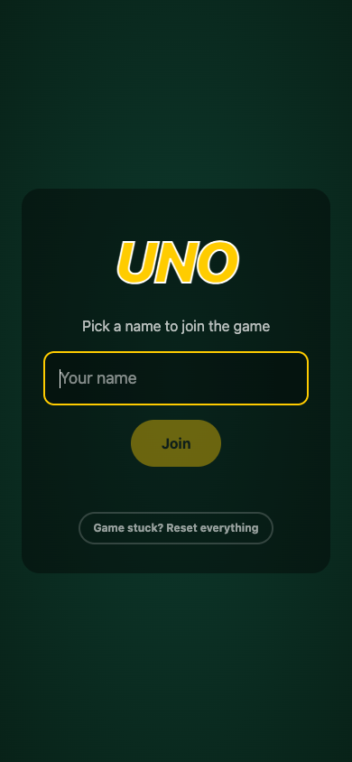
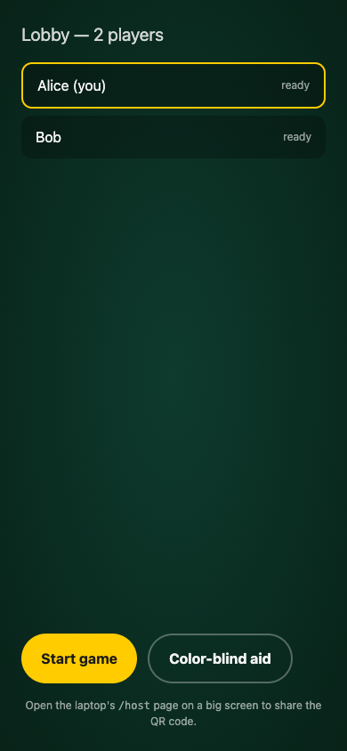
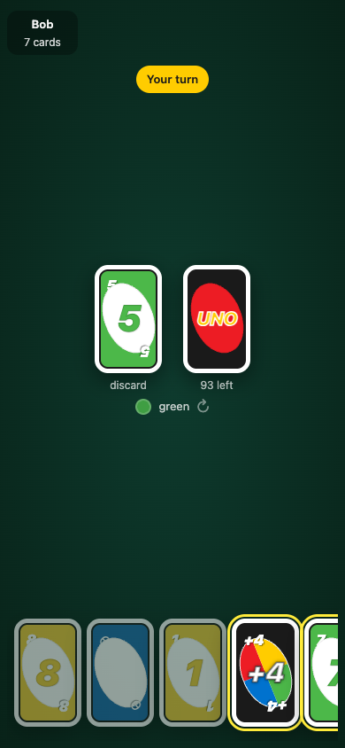
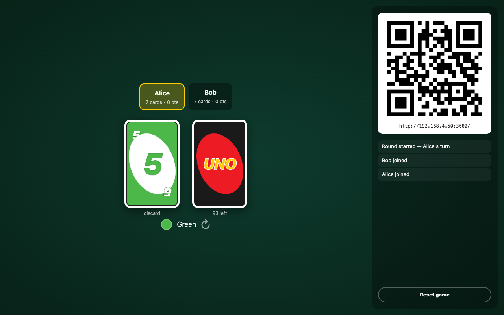

# UNO

A real-time multiplayer UNO card game. Play locally over Wi-Fi or deploy to Cloudflare Workers for free, anywhere-on-the-internet play.


## Features

- **Open laptop, scan QR, play.** No accounts, no rooms, no setup.
- **All official rules** — Skip, Reverse, +2, Wild, Wild +4, UNO calls, call-outs.
- **+2 / +4 stacking** (same-type only) — house rule enabled.
- **Draw-and-play-if-matches** — official rule enabled.
- **Real UNO card visuals** — pure CSS, no images, scales perfectly on phones.
- **Mobile-first** — big tap targets, horizontal-scroll hand, color picker for Wilds.
- **Refresh-rejoin** — reload your phone mid-game and you keep your seat.

## Tech stack

| | |
|---|---|
| Server | [Cloudflare Workers](https://workers.cloudflare.com/) + [Durable Objects](https://developers.cloudflare.com/durable-objects/) (WebSocket Hibernation API) |
| Frontend | React 19 + Vite 6 + TypeScript |
| Styling | Tailwind v4 + custom CSS for cards |
| Static hosting | Workers Assets (single deploy) |
| Lint/format | [Biome](https://biomejs.dev) |

## Run locally

Wrangler requires Node ≥22. macOS Homebrew Node works (`/opt/homebrew/bin/node`).

```bash
bun install
bun run preview        # builds + runs the Worker locally on :3000
```

Open `http://localhost:3000/host` on your laptop, scan the QR with your phone (same Wi-Fi).

For hot-reload on the React side, use `bun run dev` (Vite at :5173 with `/ws` proxy to wrangler dev at :3000).

## Deploy to Cloudflare (free tier)

```bash
bun run cf:login       # opens browser to auth your Cloudflare account
bun run deploy         # builds + uploads Worker + static assets
```

That's it. You get a `https://uno.<your-subdomain>.workers.dev` URL. Bind a custom domain via the Cloudflare dashboard if you want.

**Free tier covers this comfortably:**
- 100k requests/day (each WS message ≈ 1/20th of a request)
- 13k GB-seconds/day duration — idle WebSockets are **free** thanks to the Hibernation API
- 5 GB SQLite storage — game state stays in-memory, doesn't touch storage

## Rules

Standard UNO (108-card deck). Two house tweaks active:

- **Stacking** +2 / +4 (a +2 onto a +2, a +4 onto a +4) — chain accumulates until someone draws.
- **Draw-and-play-if-matches** — when you can't play, you draw 1; if it matches you may play it immediately.

Wild Draw Four challenge is off; first-flip action cards are reshuffled until a number turns up. First to 500 points wins.

## Screenshots

| Phone — join | Phone — lobby | Phone — playing |
|:---:|:---:|:---:|
|  |  |  |

| Laptop — table view |
|:---:|
|  |

## Scripts

```bash
bun run dev          # Vite + wrangler dev (HMR)
bun run preview      # build + run Worker locally
bun run build        # production build
bun run deploy       # build + push to Cloudflare
bun run cf:login     # Cloudflare auth
bun run typecheck
bun run check        # biome lint + format
```

## Project layout

```
worker/
  index.ts         ── Worker entry: routes /ws to the Durable Object
  game-room.ts     ── DurableObject class with WebSocket Hibernation
server/
  deck.ts, rules.ts, game.ts, types.ts   ── pure game logic (Worker imports)
src/
  React app (player + host screens) + native WS client
wrangler.toml      ── Cloudflare config + DO binding + Assets binding
```

## Caveats

- **Single shared room.** Anyone hitting the URL joins the same game. Great for "send the URL to 3 friends" — bad for public sharing. Add room codes if you need multi-game support.
- **In-memory state.** Durable Objects can be evicted after long idleness, which would reset the game. Hibernation keeps state through normal pauses (turns, mid-game phone-swap). For persistence, write `game` fields to `state.storage`.
- **Reset button** on `/host` and the join screen clears stuck sessions.

## License

MIT.
